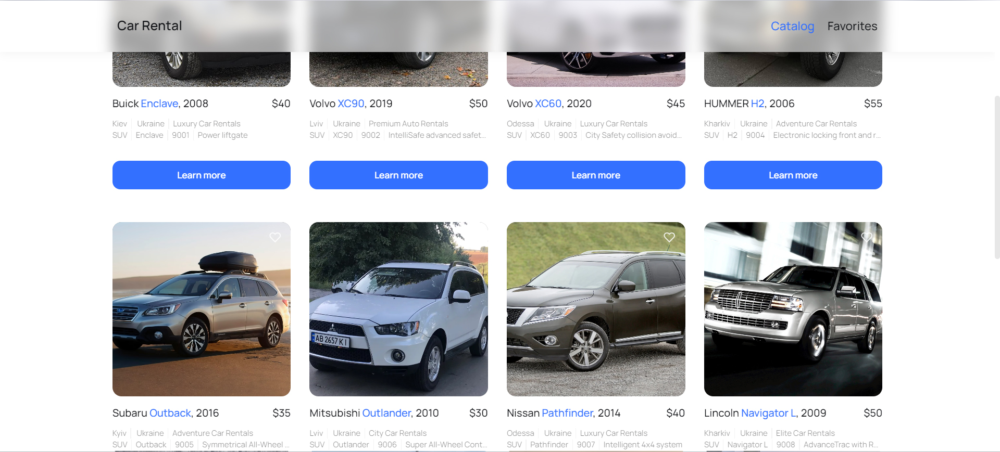
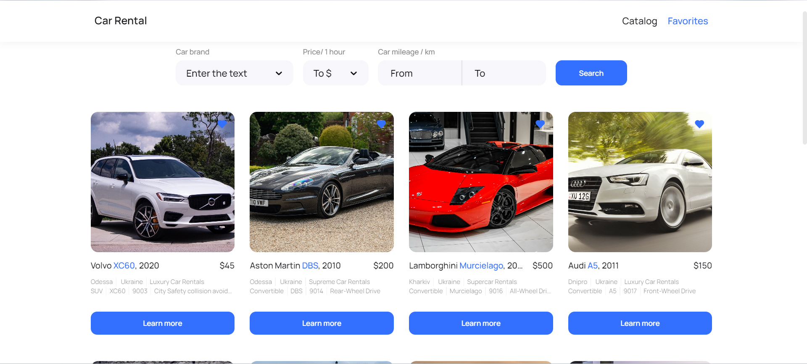

# Сar Rental App

Welcome to the Сar Rental Application repository!

This app provides a convenient platform for renting cars in Ukraine. With a user-friendly interface and a wide range of vehicle options, it's easier than ever to find the perfect ride for your journey.

## Review

- Home page

- Catalog page

- Favorites page

- Modal window

## Features

- **Discover a Variety of Vehicles:** Browse through our extensive catalog of vehicles, including sedans, SUVs, hybrids, and more.

- **Easy Filtering:** Use our advanced filtering options to find the ideal car based on brand, hourly rental rates, or mileage covered during previous use.

- **Favorites List:** Save your favorite cars to your personal list for quick access and comparison.

- **Transparent Booking:** Our straightforward booking process ensures a hassle-free reservation experience with no hidden fees.

## This is a repository that uses the following technologies: ##

#### Frontend:

- **react**
- **react router dom**
- **styled components**
- **responsive markup**

#### Backend:

- **mockapi.io**

## How to Contribute

If you wish to make your own fixes or improvements, you should:

1. Clone the repository to your computer.
2. Make changes and additions to the source code.
3. Test to ensure everything works correctly.
4. Submit a pull request with your changes.

## Author

The "Сar Rental App" is developed by M-Farmaha in 2023.

## License

This project is distributed under the MIT License.

## Recommended Browser

We recommend using Google Chrome for the best experience when using our app.
